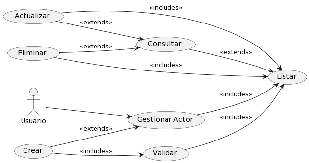
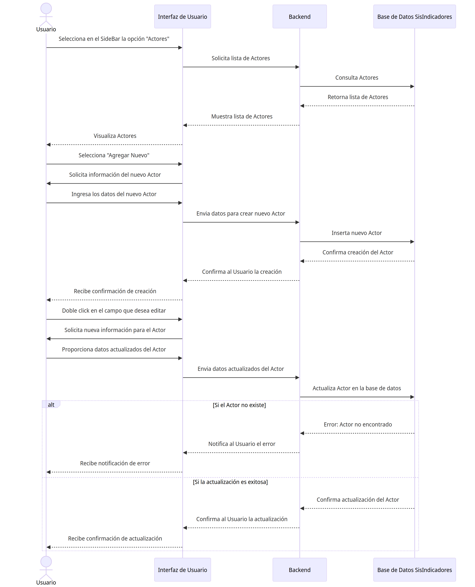

# Actor

## Diagramas

### Diagrama de Caso de Uso

### Diagrama de Secuencia

## Historias de Usuario

### Listar

| **Caso de Uso** | Listar Actores |
|---|---|
| **Actores** | Usuario, Base de datos SisIndicadores |
| **Tipo** | Inclusión |
| **Propósito** | Listar todos los Actores disponibles en el sistema de indicadores para su administración y consulta. |
| **Resumen** | Este caso de uso se activa cuando el Usuario requiere ver la lista completa de Actores. Permite al usuario visualizar una lista ordenada y posiblemente filtrada de Actores registrados en el sistema. |
| **Precondiciones** | El Usuario debe estar autenticado y tener permisos para acceder a la lista de Actores. |
| **Flujo Principal** | El Usuario accede a la sección "Actores" en la interfaz de usuario (UI-1). Se le presenta una lista de Actores disponibles en el sistema. El usuario puede seleccionar un Actor para ver más detalles o realizar acciones adicionales. |
| **Subflujos** | Desde la lista de Actores, el usuario puede optar por ver detalles de un Actor específico (Detalle), actualizar información de un Actor (Actualizar), o crear un nuevo Actor (Crear). Puede volver a esta lista en cualquier momento para realizar más operaciones. |
| **Excepciones** | Si la lista no puede ser generada o está vacía, se muestra el mensaje "The actor list could not be retrieved. Try again later." Si el Usuario no tiene permisos, se muestra "The operation was cancelled." |
---

### Detalle

| **Caso de Uso** | Detalle de Actor |
|---|---|
| **Actores** | Usuario, Base de datos SisIndicadores |
| **Tipo** | Inclusión |
| **Propósito** | Proporcionar al Usuario una visualización detallada de la información de un Actor específico dentro del sistema de indicadores. |
| **Resumen** | Este caso de uso comienza cuando el Usuario selecciona un Actor específico de la lista para ver en detalle. El sistema muestra una página con toda la información detallada del Actor seleccionado. |
| **Precondiciones** | El Usuario debe estar autenticado y tener permisos para acceder a los detalles de un Actor. |
| **Flujo Principal** | En la interfaz de gestión de Actores (UI-1), el Usuario selecciona un Actor de la lista.  |
| **Subflujos** | Ninguno|
| **Excepciones** | Si el Actor no existe o no se encuentra, se muestra el mensaje "The actor was not found." Si ocurre un error al intentar mostrar los detalles, se muestra "An error occurred while processing the request. Try to contact the support team." |
---

### Crear

| **Caso de Uso** | Crear Actor |
|---|---|
| **Actores** | Usuario, Base de datos SisIndicadores |
| **Tipo** | Inclusión |
| **Propósito** | Permitir al Usuario agregar un nuevo Actor al sistema de indicadores. |
| **Resumen** | Este caso de uso se inicia cuando el Usuario necesita ingresar un nuevo Actor al sistema. El Usuario proporciona los detalles necesarios para registrar un nuevo Actor y lo añade al sistema a través de una interfaz de usuario. |
| **Precondiciones** | El Usuario debe estar autenticado y tener permisos para añadir nuevos Actores al sistema. |
| **Flujo Principal** | El Usuario navega a la opción "Agregar Nuevo" en la interfaz de usuario (UI-1). Completa el formulario con la información del nuevo Actor y selecciona la opción "Guardar" para crear el registro. |
| **Subflujos** | Después de la creación, el Usuario puede ser redirigido a la lista de Actores para confirmar que el nuevo Actor se ha agregado correctamente o para continuar con la creación de otros Actores. |
| **Excepciones** | Si los detalles proporcionados son insuficientes o incorrectos, se muestra el mensaje "cannot be empty." Si el Actor ya existe, se muestra "The actor already exists." En caso de un error inesperado durante la creación, se muestra "Something was wrong. Try again later." |
---

### Actualizar

| **Caso de Uso** | Actualizar Actor |
|---|---|
| **Actores** | Usuario, Base de datos SisIndicadores |
| **Tipo** | Inclusión |
| **Propósito** | Habilitar al Usuario para modificar la información de un Actor existente dentro del sistema de indicadores. |
| **Resumen** | Este caso de uso ocurre cuando un Usuario necesita cambiar los datos de un Actor. El Usuario selecciona un Actor específico de la lista y actualiza la información necesaria a través de un formulario. |
| **Precondiciones** | El Usuario debe estar autenticado y tener los permisos necesarios para editar la información de un Actor. |
| **Flujo Principal** | Desde la página de gestión de Actor (P-1), el Usuario selecciona un Actor de la lista. Doble click en el campo que desea modificar y reemplaza el valor. Presiona el icono de "guardar". El sistema valida y actualiza el valor. |
| **Subflujos** | Una vez actualizado el Actor, el Usuario puede volver a la lista de Actores para ver los cambios realizados o para actualizar otros Actores. |
| **Excepciones** | Si el Actor no se encuentra para la actualización, se muestra "The actor was not found." Si hay discrepancias en los datos proporcionados, se muestra "The value does not coincide with." Si se produce un fallo al guardar los cambios, se muestra "Something was wrong. Try again later." |
---

### Eliminar

| **Caso de Uso** | Eliminar Actor |
|---|---|
| **Actores** | Usuario, Base de datos SisIndicadores |
| **Tipo** | Exclusión |
| **Propósito** | Permitir al Usuario eliminar un Actor existente del sistema de indicadores. |
| **Resumen** | Este caso de uso permite al Usuario seleccionar un Actor de la lista y eliminarlo del sistema. Esta acción es irreversible y debe ser manejada con precaución para evitar la eliminación accidental de información importante. |
| **Precondiciones** | El Usuario debe estar autenticado y tener permisos para eliminar Actores. |
| **Flujo Principal** | Desde la página de gestión de Actores (P-1), el Usuario selecciona un Actor de la lista. Doble click en el campo que desea modificar y reemplaza el valor. Presiona el icono de "guardar". El sistema valida |
| **Subflujos** | Ninguno. |
| **Excepciones** | Si el Actor no se encuentra, se muestra "The actor was not found." Si el Actor no puede ser eliminado debido a dependencias existentes, se muestra "The actor cannot be deleted due to existing dependencies." Si ocurre un error durante el proceso de eliminación, se muestra "Something was wrong. Try again later." |
---
