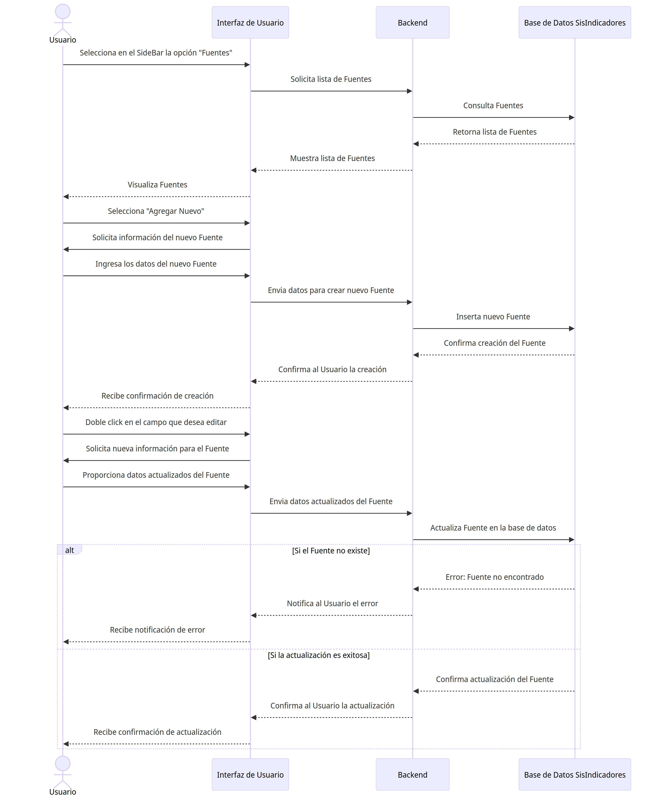

# Fuente

## Diagramas

### Diagrama de Caso de Uso

### Diagrama de Secuencia

## Historias de Usuario

### Listar

| **Caso de Uso** | Listar Fuentes |
|---|---|
| **Fuentes** | Usuario, Base de datos SisIndicadores |
| **Tipo** | Inclusión |
| **Propósito** | Listar todos las Fuentes disponibles en el sistema de indicadores para su administración y consulta. |
| **Resumen** | Este caso de uso se activa cuando el Usuario requiere ver la lista completa de Fuentes. Permite al usuario visualizar una lista ordenada y posiblemente filtrada de Fuentes registrados en el sistema. |
| **Precondiciones** | El Usuario debe estar autenticado y tener permisos para acceder a la lista de Fuentes. |
| **Flujo Principal** | El Usuario accede a la sección "Fuentes" en la interfaz de usuario (UI-1). Se le presenta una lista de Fuentes disponibles en el sistema. El usuario puede seleccionar una Fuente para ver más detalles o realizar acciones adicionales. |
| **Subflujos** | Desde la lista de Fuentes, el usuario puede optar por ver detalles de una Fuente específico (Detalle), actualizar información de una Fuente (Actualizar), o crear un nuevo Fuente (Crear). Puede volver a esta lista en cualquier momento para realizar más operaciones. |
| **Excepciones** | Si la lista no puede ser generada o está vacía, se muestra el mensaje "The source list could not be retrieved. Try again later." Si el Usuario no tiene permisos, se muestra "The operation was cancelled." |
---

### Detalle

| **Caso de Uso** | Detalle de Fuente |
|---|---|
| **Fuentes** | Usuario, Base de datos SisIndicadores |
| **Tipo** | Inclusión |
| **Propósito** | Proporcionar al Usuario una visualización detallada de la información de una Fuente específico dentro del sistema de indicadores. |
| **Resumen** | Este caso de uso comienza cuando el Usuario selecciona una Fuente específico de la lista para ver en detalle. El sistema muestra una página con toda la información detallada del Fuente seleccionado. |
| **Precondiciones** | El Usuario debe estar autenticado y tener permisos para acceder a los detalles de una Fuente. |
| **Flujo Principal** | En la interfaz de gestión de Fuentes (UI-1), el Usuario selecciona una Fuente de la lista.  |
| **Subflujos** | Ninguno|
| **Excepciones** | Si la Fuente no existe o no se encuentra, se muestra el mensaje "The source was not found." Si ocurre un error al intentar mostrar los detalles, se muestra "An error occurred while processing the request. Try to contact the support team." |
---

### Crear

| **Caso de Uso** | Crear Fuente |
|---|---|
| **Fuentes** | Usuario, Base de datos SisIndicadores |
| **Tipo** | Inclusión |
| **Propósito** | Permitir al Usuario agregar un nuevo Fuente al sistema de indicadores. |
| **Resumen** | Este caso de uso se inicia cuando el Usuario necesita ingresar un nuevo Fuente al sistema. El Usuario proporciona los detalles necesarios para registrar un nuevo Fuente y lo añade al sistema a través de una interfaz de usuario. |
| **Precondiciones** | El Usuario debe estar autenticado y tener permisos para añadir nuevos Fuentes al sistema. |
| **Flujo Principal** | El Usuario navega a la opción "Agregar Nuevo" en la interfaz de usuario (UI-1). Completa el formulario con la información del nuevo Fuente y selecciona la opción "Guardar" para crear el registro. |
| **Subflujos** | Después de la creación, el Usuario puede ser redirigido a la lista de Fuentes para confirmar que el nuevo Fuente se ha agregado correctamente o para continuar con la creación de otros Fuentes. |
| **Excepciones** | Si los detalles proporcionados son insuficientes o incorrectos, se muestra el mensaje "cannot be empty." Si la Fuente ya existe, se muestra "The source already exists." En caso de un error inesperado durante la creación, se muestra "Something was wrong. Try again later." |
---

### Actualizar

| **Caso de Uso** | Actualizar Fuente |
|---|---|
| **Fuentes** | Usuario, Base de datos SisIndicadores |
| **Tipo** | Inclusión |
| **Propósito** | Habilitar al Usuario para modificar la información de una Fuente existente dentro del sistema de indicadores. |
| **Resumen** | Este caso de uso ocurre cuando un Usuario necesita cambiar los datos de una Fuente. El Usuario selecciona una Fuente específico de la lista y actualiza la información necesaria a través de un formulario. |
| **Precondiciones** | El Usuario debe estar autenticado y tener los permisos necesarios para editar la información de una Fuente. |
| **Flujo Principal** | Desde la página de gestión de Fuente (P-1), el Usuario selecciona una Fuente de la lista. Doble click en el campo que desea modificar y reemplaza el valor. Presiona el icono de "guardar". El sistema valida y actualiza el valor. |
| **Subflujos** | Una vez actualizado la Fuente, el Usuario puede volver a la lista de Fuentes para ver los cambios realizados o para actualizar otros Fuentes. |
| **Excepciones** | Si la Fuente no se encuentra para la actualización, se muestra "The source was not found." Si hay discrepancias en los datos proporcionados, se muestra "The value does not coincide with." Si se produce un fallo al guardar los cambios, se muestra "Something was wrong. Try again later." |
---

### Eliminar

| **Caso de Uso** | Eliminar Fuente |
|---|---|
| **Actores** | Usuario, Base de datos SisIndicadores |
| **Tipo** | Exclusión |
| **Propósito** | Permitir al Usuario eliminar un Fuente existente del sistema de indicadores. |
| **Resumen** | Este caso de uso permite al Usuario seleccionar un Fuente de la lista y eliminarlo del sistema. Esta acción es irreversible y debe ser manejada con precaución para evitar la eliminación accidental de información importante. |
| **Precondiciones** | El Usuario debe estar autenticado y tener permisos para eliminar Fuentes. |
| **Flujo Principal** | Desde la página de gestión de Fuentes (P-1), el Usuario selecciona un Fuente de la lista. Doble click en el campo que desea modificar y reemplaza el valor. Presiona el icono de "guardar". El sistema valida |
| **Subflujos** | Ninguno. |
| **Excepciones** | Si el Fuente no se encuentra, se muestra "The source was not found." Si el Fuente no puede ser eliminado debido a dependencias existentes, se muestra "The source cannot be deleted due to existing dependencies." Si ocurre un error durante el proceso de eliminación, se muestra "Something was wrong. Try again later." |
---
