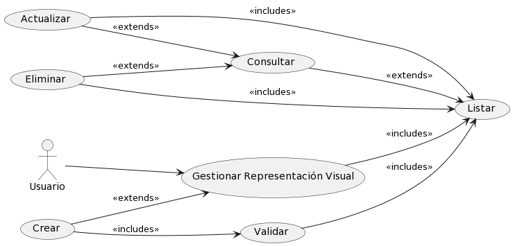

# Representación Visual

## Diagramas

### Diagrama de Caso de Uso

### Diagrama de Secuencia

## Historias de Usuario

### Listar

| **Caso de Uso** | Listar Representaciones Visuales |
|---|---|
| **Representaciones Visuales** | Usuario, Base de datos SisIndicadores |
| **Tipo** | Inclusión |
| **Propósito** | Listar todos las Representaciones Visuales disponibles en el sistema de indicadores para su administración y consulta. |
| **Resumen** | Este caso de uso se activa cuando el Usuario requiere ver la lista completa de Representaciones Visuales. Permite al usuario visualizar una lista ordenada y posiblemente filtrada de Representaciones Visuales registrados en el sistema. |
| **Precondiciones** | El Usuario debe estar autenticado y tener permisos para acceder a la lista de Representaciones Visuales. |
| **Flujo Principal** | El Usuario accede a la sección "Representaciones Visuales" en la interfaz de usuario (UI-1). Se le presenta una lista de Representaciones Visuales disponibles en el sistema. El usuario puede seleccionar una Representación Visual para ver más detalles o realizar acciones adicionales. |
| **Subflujos** | Desde la lista de Representaciones Visuales, el usuario puede optar por ver detalles de una Representación Visual específico (Detalle), actualizar información de una Representación Visual (Actualizar), o crear un nuevo Representación Visual (Crear). Puede volver a esta lista en cualquier momento para realizar más operaciones. |
| **Excepciones** | Si la lista no puede ser generada o está vacía, se muestra el mensaje "The display list could not be retrieved. Try again later." Si el Usuario no tiene permisos, se muestra "The operation was cancelled." |
---

### Detalle

| **Caso de Uso** | Detalle de Representación Visual |
|---|---|
| **Representaciones Visuales** | Usuario, Base de datos SisIndicadores |
| **Tipo** | Inclusión |
| **Propósito** | Proporcionar al Usuario una visualización detallada de la información de una Representación Visual específico dentro del sistema de indicadores. |
| **Resumen** | Este caso de uso comienza cuando el Usuario selecciona una Representación Visual específico de la lista para ver en detalle. El sistema muestra una página con toda la información detallada del Representación Visual seleccionado. |
| **Precondiciones** | El Usuario debe estar autenticado y tener permisos para acceder a los detalles de una Representación Visual. |
| **Flujo Principal** | En la interfaz de gestión de Representaciones Visuales (UI-1), el Usuario selecciona una Representación Visual de la lista.  |
| **Subflujos** | Ninguno|
| **Excepciones** | Si la Representación Visual no existe o no se encuentra, se muestra el mensaje "The display was not found." Si ocurre un error al intentar mostrar los detalles, se muestra "An error occurred while processing the request. Try to contact the support team." |
---

### Crear

| **Caso de Uso** | Crear Representación Visual |
|---|---|
| **Representaciones Visuales** | Usuario, Base de datos SisIndicadores |
| **Tipo** | Inclusión |
| **Propósito** | Permitir al Usuario agregar un nuevo Representación Visual al sistema de indicadores. |
| **Resumen** | Este caso de uso se inicia cuando el Usuario necesita ingresar un nuevo Representación Visual al sistema. El Usuario proporciona los detalles necesarios para registrar un nuevo Representación Visual y lo añade al sistema a través de una interfaz de usuario. |
| **Precondiciones** | El Usuario debe estar autenticado y tener permisos para añadir nuevos Representaciones Visuales al sistema. |
| **Flujo Principal** | El Usuario navega a la opción "Agregar Nuevo" en la interfaz de usuario (UI-1). Completa el formulario con la información del nuevo Representación Visual y selecciona la opción "Guardar" para crear el registro. |
| **Subflujos** | Después de la creación, el Usuario puede ser redirigido a la lista de Representaciones Visuales para confirmar que el nuevo Representación Visual se ha agregado correctamente o para continuar con la creación de otros Representaciones Visuales. |
| **Excepciones** | Si los detalles proporcionados son insuficientes o incorrectos, se muestra el mensaje "cannot be empty." Si la Representación Visual ya existe, se muestra "The display already exists." En caso de un error inesperado durante la creación, se muestra "Something was wrong. Try again later." |
---

### Actualizar

| **Caso de Uso** | Actualizar Representación Visual |
|---|---|
| **Representaciones Visuales** | Usuario, Base de datos SisIndicadores |
| **Tipo** | Inclusión |
| **Propósito** | Habilitar al Usuario para modificar la información de una Representación Visual existente dentro del sistema de indicadores. |
| **Resumen** | Este caso de uso ocurre cuando un Usuario necesita cambiar los datos de una Representación Visual. El Usuario selecciona una Representación Visual específico de la lista y actualiza la información necesaria a través de un formulario. |
| **Precondiciones** | El Usuario debe estar autenticado y tener los permisos necesarios para editar la información de una Representación Visual. |
| **Flujo Principal** | Desde la página de gestión de Representación Visual (P-1), el Usuario selecciona una Representación Visual de la lista. Doble click en el campo que desea modificar y reemplaza el valor. Presiona el icono de "guardar". El sistema valida y actualiza el valor. |
| **Subflujos** | Una vez actualizado la Representación Visual, el Usuario puede volver a la lista de Representaciones Visuales para ver los cambios realizados o para actualizar otros Representaciones Visuales. |
| **Excepciones** | Si la Representación Visual no se encuentra para la actualización, se muestra "The display was not found." Si hay discrepancias en los datos proporcionados, se muestra "The value does not coincide with." Si se produce un fallo al guardar los cambios, se muestra "Something was wrong. Try again later." |
---
