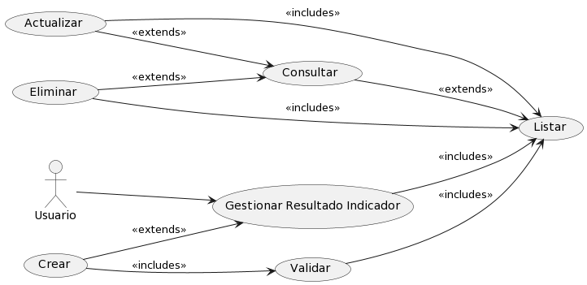
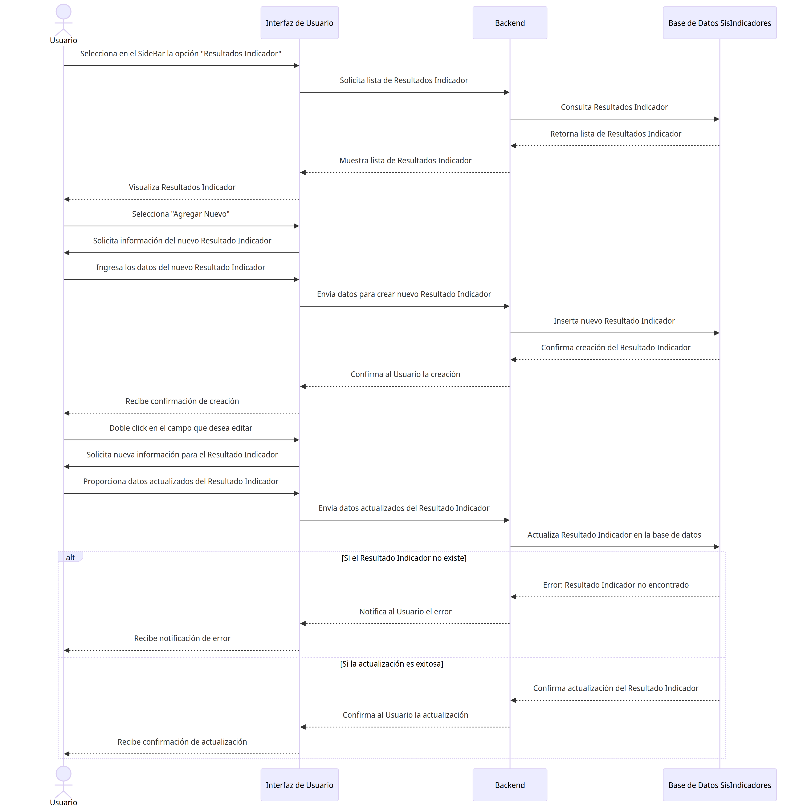

# Resultado Indicador

## Diagramas

### Diagrama de Caso de Uso

### Diagrama de Secuencia

## Historias de Usuario

### Listar

| **Caso de Uso** | Listar Resultados Indicador |
|---|---|
| **Resultados Indicador** | Usuario, Base de datos SisIndicadores |
| **Tipo** | Inclusión |
| **Propósito** | Listar todos los Resultados Indicador disponibles en el sistema de indicadores para su administración y consulta. |
| **Resumen** | Este caso de uso se activa cuando el Usuario requiere ver la lista completa de Resultados Indicador. Permite al usuario visualizar una lista ordenada y posiblemente filtrada de Resultados Indicador registrados en el sistema. |
| **Precondiciones** | El Usuario debe estar autenticado y tener permisos para acceder a la lista de Resultados Indicador. |
| **Flujo Principal** | El Usuario accede a la sección "Resultados Indicador" en la interfaz de usuario (UI-1). Se le presenta una lista de Resultados Indicador disponibles en el sistema. El usuario puede seleccionar un Resultado Indicador para ver más detalles o realizar acciones adicionales. |
| **Subflujos** | Desde la lista de Resultados Indicador, el usuario puede optar por ver detalles de un Resultado Indicador específico (Detalle), actualizar información de un Resultado Indicador (Actualizar), o crear un nuevo Resultado Indicador (Crear). Puede volver a esta lista en cualquier momento para realizar más operaciones. |
| **Excepciones** | Si la lista no puede ser generada o está vacía, se muestra el mensaje "The indicator result list could not be retrieved. Try again later." Si el Usuario no tiene permisos, se muestra "The operation was cancelled." |
---

### Detalle

| **Caso de Uso** | Detalle de Resultado Indicador |
|---|---|
| **Resultados Indicador** | Usuario, Base de datos SisIndicadores |
| **Tipo** | Inclusión |
| **Propósito** | Proporcionar al Usuario una visualización detallada de la información de un Resultado Indicador específico dentro del sistema de indicadores. |
| **Resumen** | Este caso de uso comienza cuando el Usuario selecciona un Resultado Indicador específico de la lista para ver en detalle. El sistema muestra una página con toda la información detallada del Resultado Indicador seleccionado. |
| **Precondiciones** | El Usuario debe estar autenticado y tener permisos para acceder a los detalles de un Resultado Indicador. |
| **Flujo Principal** | En la interfaz de gestión de Resultados Indicador (UI-1), el Usuario selecciona un Resultado Indicador de la lista.  |
| **Subflujos** | Ninguno|
| **Excepciones** | Si el Resultado Indicador no existe o no se encuentra, se muestra el mensaje "The indicator result was not found." Si ocurre un error al intentar mostrar los detalles, se muestra "An error occurred while processing the request. Try to contact the support team." |
---

### Crear

| **Caso de Uso** | Crear Resultado Indicador |
|---|---|
| **Resultados Indicador** | Usuario, Base de datos SisIndicadores |
| **Tipo** | Inclusión |
| **Propósito** | Permitir al Usuario agregar un nuevo Resultado Indicador al sistema de indicadores. |
| **Resumen** | Este caso de uso se inicia cuando el Usuario necesita ingresar un nuevo Resultado Indicador al sistema. El Usuario proporciona los detalles necesarios para registrar un nuevo Resultado Indicador y lo añade al sistema a través de una interfaz de usuario. |
| **Precondiciones** | El Usuario debe estar autenticado y tener permisos para añadir nuevos Resultados Indicador al sistema. |
| **Flujo Principal** | El Usuario navega a la opción "Agregar Nuevo" en la interfaz de usuario (UI-1). Completa el formulario con la información del nuevo Resultado Indicador y selecciona la opción "Guardar" para crear el registro. |
| **Subflujos** | Después de la creación, el Usuario puede ser redirigido a la lista de Resultados Indicador para confirmar que el nuevo Resultado Indicador se ha agregado correctamente o para continuar con la creación de otros Resultados Indicador. |
| **Excepciones** | Si los detalles proporcionados son insuficientes o incorrectos, se muestra el mensaje "cannot be empty." Si el Resultado Indicador ya existe, se muestra "The indicator result already exists." En caso de un error inesperado durante la creación, se muestra "Something was wrong. Try again later." |
---

### Actualizar

| **Caso de Uso** | Actualizar Resultado Indicador |
|---|---|
| **Resultados Indicador** | Usuario, Base de datos SisIndicadores |
| **Tipo** | Inclusión |
| **Propósito** | Habilitar al Usuario para modificar la información de un Resultado Indicador existente dentro del sistema de indicadores. |
| **Resumen** | Este caso de uso ocurre cuando un Usuario necesita cambiar los datos de un Resultado Indicador. El Usuario selecciona un Resultado Indicador específico de la lista y actualiza la información necesaria a través de un formulario. |
| **Precondiciones** | El Usuario debe estar autenticado y tener los permisos necesarios para editar la información de un Resultado Indicador. |
| **Flujo Principal** | Desde la página de gestión de Resultado Indicador (P-1), el Usuario selecciona un Resultado Indicador de la lista. Doble click en el campo que desea modificar y reemplaza el valor. Presiona el icono de "guardar". El sistema valida y actualiza el valor. |
| **Subflujos** | Una vez actualizado el Resultado Indicador, el Usuario puede volver a la lista de Resultados Indicador para ver los cambios realizados o para actualizar otros Resultados Indicador. |
| **Excepciones** | Si el Resultado Indicador no se encuentra para la actualización, se muestra "The indicator result was not found." Si hay discrepancias en los datos proporcionados, se muestra "The value does not coincide with." Si se produce un fallo al guardar los cambios, se muestra "Something was wrong. Try again later." |
---
