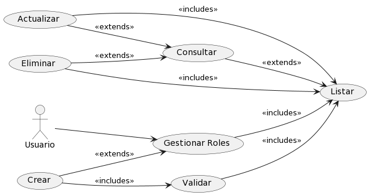

# Rol

## Diagramas

### Diagrama de Caso de Uso

### Diagrama de Secuencia

## Historias de Usuario

### Listar

| **Caso de Uso** | Listar Roles |
|---|---|
| **Roles** | Usuario, Base de datos SisIndicadores |
| **Tipo** | Inclusión |
| **Propósito** | Listar todos los Roles disponibles en el sistema de indicadores para su administración y consulta. |
| **Resumen** | Este caso de uso se activa cuando el Usuario requiere ver la lista completa de Roles. Permite al usuario visualizar una lista ordenada y posiblemente filtrada de Roles registrados en el sistema. |
| **Precondiciones** | El Usuario debe estar autenticado y tener permisos para acceder a la lista de Roles. |
| **Flujo Principal** | El Usuario accede a la sección "Roles" en la interfaz de usuario (UI-1). Se le presenta una lista de Roles disponibles en el sistema. El usuario puede seleccionar un Rol para ver más detalles o realizar acciones adicionales. |
| **Subflujos** | Desde la lista de Roles, el usuario puede optar por ver detalles de un Rol específico (Detalle), actualizar información de un Rol (Actualizar), o crear un nuevo Rol (Crear). Puede volver a esta lista en cualquier momento para realizar más operaciones. |
| **Excepciones** | Si la lista no puede ser generada o está vacía, se muestra el mensaje "The role list could not be retrieved. Try again later." Si el Usuario no tiene permisos, se muestra "The operation was cancelled." |
---

### Detalle

| **Caso de Uso** | Detalle de Rol |
|---|---|
| **Roles** | Usuario, Base de datos SisIndicadores |
| **Tipo** | Inclusión |
| **Propósito** | Proporcionar al Usuario una visualización detallada de la información de un Rol específico dentro del sistema de indicadores. |
| **Resumen** | Este caso de uso comienza cuando el Usuario selecciona un Rol específico de la lista para ver en detalle. El sistema muestra una página con toda la información detallada del Rol seleccionado. |
| **Precondiciones** | El Usuario debe estar autenticado y tener permisos para acceder a los detalles de un Rol. |
| **Flujo Principal** | En la interfaz de gestión de Roles (UI-1), el Usuario selecciona un Rol de la lista.  |
| **Subflujos** | Ninguno|
| **Excepciones** | Si el Rol no existe o no se encuentra, se muestra el mensaje "The role was not found." Si ocurre un error al intentar mostrar los detalles, se muestra "An error occurred while processing the request. Try to contact the support team." |
---

### Crear

| **Caso de Uso** | Crear Rol |
|---|---|
| **Roles** | Usuario, Base de datos SisIndicadores |
| **Tipo** | Inclusión |
| **Propósito** | Permitir al Usuario agregar un nuevo Rol al sistema de indicadores. |
| **Resumen** | Este caso de uso se inicia cuando el Usuario necesita ingresar un nuevo Rol al sistema. El Usuario proporciona los detalles necesarios para registrar un nuevo Rol y lo añade al sistema a través de una interfaz de usuario. |
| **Precondiciones** | El Usuario debe estar autenticado y tener permisos para añadir nuevos Roles al sistema. |
| **Flujo Principal** | El Usuario navega a la opción "Agregar Nuevo" en la interfaz de usuario (UI-1). Completa el formulario con la información del nuevo Rol y selecciona la opción "Guardar" para crear el registro. |
| **Subflujos** | Después de la creación, el Usuario puede ser redirigido a la lista de Roles para confirmar que el nuevo Rol se ha agregado correctamente o para continuar con la creación de otros Roles. |
| **Excepciones** | Si los detalles proporcionados son insuficientes o incorrectos, se muestra el mensaje "cannot be empty." Si el Rol ya existe, se muestra "The role already exists." En caso de un error inesperado durante la creación, se muestra "Something was wrong. Try again later." |
---

### Actualizar

| **Caso de Uso** | Actualizar Rol |
|---|---|
| **Roles** | Usuario, Base de datos SisIndicadores |
| **Tipo** | Inclusión |
| **Propósito** | Habilitar al Usuario para modificar la información de un Rol existente dentro del sistema de indicadores. |
| **Resumen** | Este caso de uso ocurre cuando un Usuario necesita cambiar los datos de un Rol. El Usuario selecciona un Rol específico de la lista y actualiza la información necesaria a través de un formulario. |
| **Precondiciones** | El Usuario debe estar autenticado y tener los permisos necesarios para editar la información de un Rol. |
| **Flujo Principal** | Desde la página de gestión de Rol (P-1), el Usuario selecciona un Rol de la lista. Doble click en el campo que desea modificar y reemplaza el valor. Presiona el icono de "guardar". El sistema valida y actualiza el valor. |
| **Subflujos** | Una vez actualizado el Rol, el Usuario puede volver a la lista de Roles para ver los cambios realizados o para actualizar otros Roles. |
| **Excepciones** | Si el Rol no se encuentra para la actualización, se muestra "The role was not found." Si hay discrepancias en los datos proporcionados, se muestra "The value does not coincide with." Si se produce un fallo al guardar los cambios, se muestra "Something was wrong. Try again later." |
---

### Eliminar

| **Caso de Uso** | Eliminar Rol |
|---|---|
| **Roles** | Usuario, Base de datos SisIndicadores |
| **Tipo** | Exclusión |
| **Propósito** | Permitir al Usuario eliminar un Rol existente del sistema de indicadores. |
| **Resumen** | Este caso de uso permite al Usuario seleccionar un Rol de la lista y eliminarlo del sistema. Esta acción es irreversible y debe ser manejada con precaución para evitar la eliminación accidental de información importante. |
| **Precondiciones** | El Usuario debe estar autenticado y tener permisos para eliminar Roles. |
| **Flujo Principal** | Desde la página de gestión de Roles (P-1), el Usuario selecciona un Rol de la lista. Doble click en el campo que desea modificar y reemplaza el valor. Presiona el icono de "guardar". El sistema valida |
| **Subflujos** | Ninguno. |
| **Excepciones** | Si el Rol no se encuentra, se muestra "The role was not found." Si el Rol no puede ser eliminado debido a dependencias existentes, se muestra "The role cannot be deleted due to existing dependencies." Si ocurre un error durante el proceso de eliminación, se muestra "Something was wrong. Try again later." |
---
