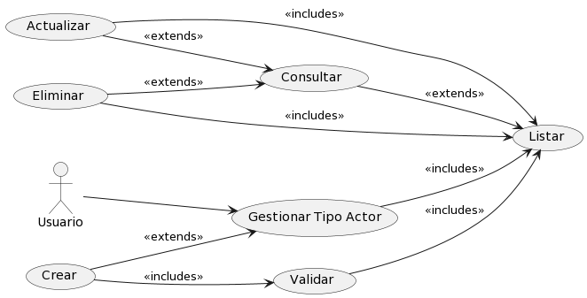
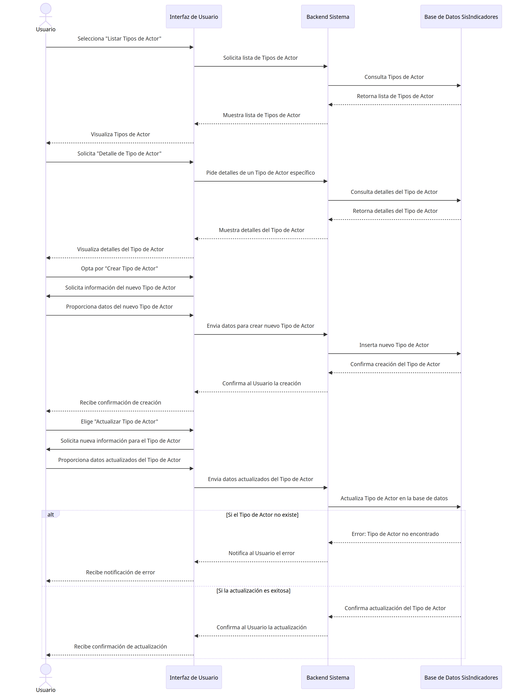

# Tipo Actor

## Diagramas

### Diagrama de Caso de Uso

### Diagrama de Secuencia

## Historias de Usuario

### Listar

| **Caso de Uso** | Listar Tipos de Actor |
|---|---|
| **Actores** | Usuario, Base de datos SisIndicadores |
| **Tipo** | Inclusión |
| **Propósito** | Listar todos los Tipos de Actor disponibles en el sistema de indicadores. |
| **Resumen** | Este caso de uso es iniciado por el Usuario. Permite al usuario visualizar una lista de todos los Tipos de Actor existentes en el sistema para facilitar la identificación y selección durante otras operaciones. |
| **Precondiciones** | El Usuario debe estar autenticado y tener permisos para listar los Tipos de Actor. |
| **Flujo Principal** | Se presenta la página de gestión de Tipos de Actor (P-1). El Usuario selecciona la opción "Ver Tipos de Actor". Se muestra una lista de los Tipos de Actor disponibles. |
| **Subflujos** | Desde la lista de Tipos de Actor, el usuario puede seleccionar un tipo para ver detalles (validación), o puede navegar a la opción de crear un nuevo Tipo de Actor (creación). Después de la creación o validación de un Tipo de Actor, el usuario puede volver a la lista principal. |
| **Excepciones** | Si la lista de Tipos de Actor no puede ser recuperada, se muestra el mensaje "Something was wrong. Try again later." Si el usuario intenta acceder a Tipos de Actor sin permisos, se muestra el mensaje "The operation was cancelled." |
---

## Detalle

| **Caso de Uso** | Detalle Tipo de Actor |
|---|---|
| **Actores** | Usuario, Base de datos SisIndicadores |
| **Tipo** | Inclusión |
| **Propósito** | Visualizar los detalles de un Tipo de Actor específico en el sistema de indicadores. |
| **Resumen** | Este caso de uso comienza cuando el Usuario selecciona un Tipo de Actor específico de la lista. El sistema muestra todos los detalles asociados a ese Tipo de Actor. |
| **Precondiciones** | El Usuario debe estar autenticado y tener permisos para visualizar los detalles de un Tipo de Actor. |
| **Flujo Principal** | Desde la página de gestión de Tipos de Actor (P-1), el Usuario selecciona un Tipo de Actor de la lista. |
| **Subflujos** | Ninguno. |
| **Excepciones** | Si el Tipo de Actor seleccionado no existe, se muestra el mensaje "The actor type was not found." Si ocurre un error inesperado al recuperar los detalles, se muestra el mensaje "An error occurred while processing the request. Try to contact the support team." |
---

## Crear

| **Caso de Uso** | Crear Tipo de Actor |
|---|---|
| **Actores** | Usuario, Base de datos SisIndicadores |
| **Tipo** | Inclusión |
| **Propósito** | Permitir al Usuario añadir un nuevo Tipo de Actor al sistema de indicadores. |
| **Resumen** | Este caso de uso empieza cuando el Usuario accede a la función para añadir un nuevo Tipo de Actor. El Usuario introduce la información necesaria y la envía para su creación. |
| **Precondiciones** | El Usuario debe estar autenticado y tener permisos para crear un nuevo Tipo de Actor. |
| **Flujo Principal** | El Usuario accede a la opción "Agregar Nuevo" en la página (P-1). Rellena el formulario con los datos del nuevo Tipo de Actor y selecciona "Guardar". El sistema valida y registra el nuevo Tipo de Actor. |
| **Subflujos** | Tras la creación exitosa, se puede redirigir al Usuario a la lista de Tipos de Actor para verificar la inclusión del nuevo Tipo (listar). |
| **Excepciones** | Si el Tipo de Actor ya existe, se muestra el mensaje "The actor type already exists." Si no se completa algún campo necesario del formulario, se muestra el mensaje "cannot be empty." Si ocurre un error durante la creación, se muestra el mensaje "Something was wrong. Try again later." |
---

## Actualizar

| **Caso de Uso** | Actualizar Tipo de Actor |
|---|---|
| **Actores** | Usuario, Base de datos SisIndicadores |
| **Tipo** | Inclusión |
| **Propósito** | Permitir al Usuario modificar los detalles de un Tipo de Actor existente en el sistema de indicadores. |
| **Resumen** | Este caso de uso inicia cuando el Usuario elige un Tipo de Actor de la lista y accede a la opción de actualizar sus datos. El Usuario edita la información requerida y la envía para actualizarla en el sistema. |
| **Precondiciones** | El Usuario debe estar autenticado y tener permisos para actualizar los datos de un Tipo de Actor. |
| **Flujo Principal** | Desde la página de gestión de Tipos de Actor (P-1), el Usuario selecciona un Tipo de Actor de la lista. Doble click en el campo que desea modificar y reemplaza el valor. Presiona el icono de "guardar". El sistema valida y actualiza el valor. |
| **Subflujos** | Ninguno |
| **Excepciones** | Si el Tipo de Actor no se encuentra, se muestra el mensaje "The actor type was not found." Si hay un conflicto con la información proporcionada, se muestra "The value does not coincide with." Si ocurre un fallo durante la actualización, se muestra "Something was wrong. Try again later." |
---
