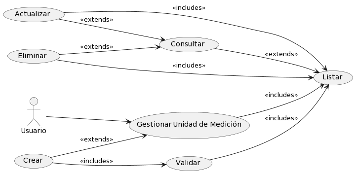

# Unidad de Medición

## Diagramas

### Diagrama de Caso de Uso

### Diagrama de Secuencia

## Historias de Usuario

### Listar

| **Caso de Uso** | Listar Unidades de Medición |
|---|---|
| **Unidades de Medición** | Usuario, Base de datos SisIndicadores |
| **Tipo** | Inclusión |
| **Propósito** | Listar todos los Unidades de Medición disponibles en el sistema de indicadores para su administración y consulta. |
| **Resumen** | Este caso de uso se activa cuando el Usuario requiere ver la lista completa de Unidades de Medición. Permite al usuario visualizar una lista ordenada y posiblemente filtrada de Unidades de Medición registrados en el sistema. |
| **Precondiciones** | El Usuario debe estar autenticado y tener permisos para acceder a la lista de Unidades de Medición. |
| **Flujo Principal** | El Usuario accede a la sección "Unidades de Medición" en la interfaz de usuario (UI-1). Se le presenta una lista de Unidades de Medición disponibles en el sistema. El usuario puede seleccionar un Unidad de Medición para ver más detalles o realizar acciones adicionales. |
| **Subflujos** | Desde la lista de Unidades de Medición, el usuario puede optar por ver detalles de un Unidad de Medición específico (Detalle), actualizar información de un Unidad de Medición (Actualizar), o crear un nuevo Unidad de Medición (Crear). Puede volver a esta lista en cualquier momento para realizar más operaciones. |
| **Excepciones** | Si la lista no puede ser generada o está vacía, se muestra el mensaje "The measurement unit list could not be retrieved. Try again later." Si el Usuario no tiene permisos, se muestra "The operation was cancelled." |
---

### Detalle

| **Caso de Uso** | Detalle de Unidad de Medición |
|---|---|
| **Unidades de Medición** | Usuario, Base de datos SisIndicadores |
| **Tipo** | Inclusión |
| **Propósito** | Proporcionar al Usuario una visualización detallada de la información de un Unidad de Medición específico dentro del sistema de indicadores. |
| **Resumen** | Este caso de uso comienza cuando el Usuario selecciona un Unidad de Medición específico de la lista para ver en detalle. El sistema muestra una página con toda la información detallada del Unidad de Medición seleccionado. |
| **Precondiciones** | El Usuario debe estar autenticado y tener permisos para acceder a los detalles de un Unidad de Medición. |
| **Flujo Principal** | En la interfaz de gestión de Unidades de Medición (UI-1), el Usuario selecciona un Unidad de Medición de la lista.  |
| **Subflujos** | Ninguno|
| **Excepciones** | Si el Unidad de Medición no existe o no se encuentra, se muestra el mensaje "The measurement unit was not found." Si ocurre un error al intentar mostrar los detalles, se muestra "An error occurred while processing the request. Try to contact the support team." |
---

### Crear

| **Caso de Uso** | Crear Unidad de Medición |
|---|---|
| **Unidades de Medición** | Usuario, Base de datos SisIndicadores |
| **Tipo** | Inclusión |
| **Propósito** | Permitir al Usuario agregar un nuevo Unidad de Medición al sistema de indicadores. |
| **Resumen** | Este caso de uso se inicia cuando el Usuario necesita ingresar un nuevo Unidad de Medición al sistema. El Usuario proporciona los detalles necesarios para registrar un nuevo Unidad de Medición y lo añade al sistema a través de una interfaz de usuario. |
| **Precondiciones** | El Usuario debe estar autenticado y tener permisos para añadir nuevos Unidades de Medición al sistema. |
| **Flujo Principal** | El Usuario navega a la opción "Agregar Nuevo" en la interfaz de usuario (UI-1). Completa el formulario con la información del nuevo Unidad de Medición y selecciona la opción "Guardar" para crear el registro. |
| **Subflujos** | Después de la creación, el Usuario puede ser redirigido a la lista de Unidades de Medición para confirmar que el nuevo Unidad de Medición se ha agregado correctamente o para continuar con la creación de otros Unidades de Medición. |
| **Excepciones** | Si los detalles proporcionados son insuficientes o incorrectos, se muestra el mensaje "cannot be empty." Si el Unidad de Medición ya existe, se muestra "The measurement unit already exists." En caso de un error inesperado durante la creación, se muestra "Something was wrong. Try again later." |
---

### Actualizar

| **Caso de Uso** | Actualizar Unidad de Medición |
|---|---|
| **Unidades de Medición** | Usuario, Base de datos SisIndicadores |
| **Tipo** | Inclusión |
| **Propósito** | Habilitar al Usuario para modificar la información de un Unidad de Medición existente dentro del sistema de indicadores. |
| **Resumen** | Este caso de uso ocurre cuando un Usuario necesita cambiar los datos de un Unidad de Medición. El Usuario selecciona un Unidad de Medición específico de la lista y actualiza la información necesaria a través de un formulario. |
| **Precondiciones** | El Usuario debe estar autenticado y tener los permisos necesarios para editar la información de un Unidad de Medición. |
| **Flujo Principal** | Desde la página de gestión de Unidad de Medición (P-1), el Usuario selecciona un Unidad de Medición de la lista. Doble click en el campo que desea modificar y reemplaza el valor. Presiona el icono de "guardar". El sistema valida y actualiza el valor. |
| **Subflujos** | Una vez actualizado el Unidad de Medición, el Usuario puede volver a la lista de Unidades de Medición para ver los cambios realizados o para actualizar otros Unidades de Medición. |
| **Excepciones** | Si el Unidad de Medición no se encuentra para la actualización, se muestra "The measurement unit was not found." Si hay discrepancias en los datos proporcionados, se muestra "The value does not coincide with." Si se produce un fallo al guardar los cambios, se muestra "Something was wrong. Try again later." |
---

### Eliminar

| **Caso de Uso** | Eliminar Unidad de Medición |
|---|---|
| **Actores** | Usuario, Base de datos SisIndicadores |
| **Tipo** | Exclusión |
| **Propósito** | Permitir al Usuario eliminar un Unidad de Medición existente del sistema de indicadores. |
| **Resumen** | Este caso de uso permite al Usuario seleccionar un Unidad de Medición de la lista y eliminarlo del sistema. Esta acción es irreversible y debe ser manejada con precaución para evitar la eliminación accidental de información importante. |
| **Precondiciones** | El Usuario debe estar autenticado y tener permisos para eliminar Unidades de Medición. |
| **Flujo Principal** | Desde la página de gestión de Unidades de Medición (P-1), el Usuario selecciona un Unidad de Medición de la lista. Doble click en el campo que desea modificar y reemplaza el valor. Presiona el icono de "guardar". El sistema valida |
| **Subflujos** | Ninguno. |
| **Excepciones** | Si el Unidad de Medición no se encuentra, se muestra "The measurement unit was not found." Si el Unidad de Medición no puede ser eliminado debido a dependencias existentes, se muestra "The measurement unit cannot be deleted due to existing dependencies." Si ocurre un error durante el proceso de eliminación, se muestra "Something was wrong. Try again later." |
---
