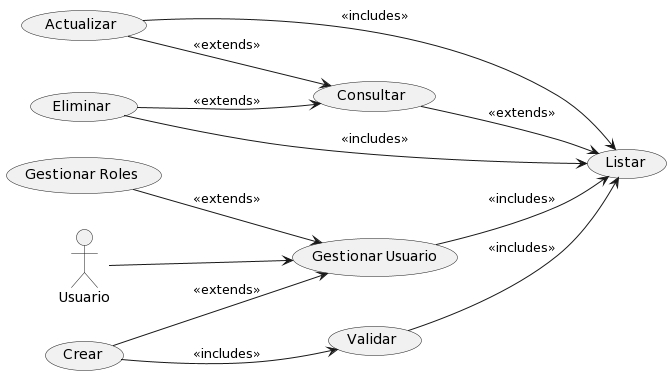

# Usuario

## Diagramas

### Diagrama de Caso de Uso

### Diagrama de Secuencia

## Historias de Usuario

### Listar

| **Caso de Uso** | Listar Usuarios |
|---|---|
| **Actores** | Usuario, Base de datos SisIndicadores |
| **Tipo** | Inclusión |
| **Propósito** | Ofrecer al Usuario una visión general de todos los Usuarios disponibles en el sistema, incluyendo su información relacionada y las tablas intermedias asociadas. |
| **Resumen** | El Usuario solicita una lista de Usuarios para su consulta, visualización o para realizar operaciones subsecuentes como la edición o el análisis de datos relacionados. La lista incluirá la relación de los Usuarios con otras entidades como Variables, Secciones y Tipos de Actores, facilitando la gestión integral del sistema. |
| **Precondiciones** | El Usuario debe estar autenticado y tener permisos para ver la lista de Usuarios. |
| **Flujo Principal** | El Usuario accede a la sección "Usuarios" en la interfaz de usuario (UI-1). La aplicación presenta una lista completa de Usuarios, incluyendo referencias cruzadas a las tablas intermedias como 'VariablePorIndicador', 'SeccionPorIndicador', que se actualizan automáticamente al añadir o modificar un Usuario. |
| **Subflujos** | El Usuario puede seleccionar un Usuario para ver detalles, actualizar la información del Usuario o agregar un nuevo Usuario, lo que a su vez puede implicar la creación o modificación de entradas en las tablas intermedias. |
| **Excepciones** | Si la lista no se puede generar, se muestra "Something was wrong. Try again later." Si el Usuario no tiene acceso, se muestra "The operation was cancelled." |
---

### Detalle

| **Caso de Uso** | Detalle de Usuario |
|---|---|
| **Actores** | Usuario, Base de datos SisIndicadores |
| **Tipo** | Inclusión |
| **Propósito** | Mostrar al Usuario información detallada de un Usuario específico, incluyendo su descripción, metodología, variables asociadas, secciones relacionadas y tipos de actores implicados. |
| **Resumen** | Este caso de uso se inicia cuando el Usuario elige un Usuario de la lista para examinar en profundidad. El sistema presenta una vista detallada que incluye toda la información del Usuario, así como las entidades relacionadas de las tablas intermedias como 'VariablePorIndicador', mostrando cómo se calcula el usuario y en qué secciones se utiliza. |
| **Precondiciones** | El Usuario debe estar autenticado y tener permisos para acceder a los detalles del Usuario. |
| **Flujo Principal** | El Usuario selecciona un Usuario y opta por el icono de "Ver Detalles" en la interfaz de gestión de Usuarios (UI-1). Se presenta una página detallada con toda la información relevante del Usuario, incluyendo las relaciones con las variables y secciones pertinentes, y cómo estas relaciones se gestionan en las tablas intermedias. |
| **Subflujos** | Desde la vista detallada, el Usuario puede proceder a actualizar la información del Usuario (Actualizar), lo que podría incluir la adición o modificación de las relaciones en las tablas intermedias. Además, el Usuario puede navegar de vuelta a la lista completa de Usuarios para seleccionar otro para el detalle. |
| **Excepciones** | Si el Usuario específico no se encuentra, se muestra el mensaje "The usuario was not found." En caso de un error al intentar cargar los detalles, se muestra "An error occurred while processing the request. Try to contact the support team." |

---

### Crear

| **Caso de Uso** | Crear Usuario |
|---|---|
| **Actores** | Usuario, Base de datos SisIndicadores |
| **Tipo** | Inclusión |
| **Propósito** | Permitir al Usuario introducir un nuevo Usuario en el sistema, incluyendo la definición de sus relaciones con otras entidades representadas en tablas intermedias. |
| **Resumen** | El Usuario ingresa a un formulario para añadir un nuevo Usuario, proporcionando toda la información requerida, como nombre, descripción, metodología, y especificando las variables y secciones relacionadas, que se reflejarán en las tablas intermedias pertinentes. |
| **Precondiciones** | El Usuario debe estar autenticado y tener permisos para añadir Usuarios al sistema. |
| **Flujo Principal** | En la interfaz de usuario (UI-1), el Usuario selecciona "Agregar Nuevo", completa el formulario con los datos del Usuario, incluyendo las relaciones con variables y secciones, y confirma la operación. Al guardar el nuevo Usuario, las tablas intermedias 'VariablePorIndicador' y 'SeccionPorIndicador' se actualizan automáticamente para reflejar estas relaciones. |
| **Subflujos** | Tras la creación, el Usuario puede optar por crear otro Usuario, verificar la lista de Usuarios actualizada o gestionar las variables y secciones relacionadas a través de las tablas intermedias. |
| **Excepciones** | Si falta alguna información necesaria, se muestra "cannot be empty." Si se produce un error durante la creación, se muestra "Something was wrong. Try again later." Si el Usuario ya existe, se muestra "The usuario already exists." |
---

### Actualizar

| **Caso de Uso** | Actualizar Usuario |
|---|---|
| **Actores** | Usuario, Base de datos SisIndicadores |
| **Tipo** | Inclusión |
| **Propósito** | Habilitar al Usuario para modificar los datos de un Usuario existente, así como gestionar sus relaciones con las variables y secciones a través de las tablas intermedias. |
| **Resumen** | El Usuario selecciona un Usuario de la lista y procede a actualizar su información y relaciones. Esto incluye cambiar nombre, descripción, metodología y ajustar las relaciones con variables y secciones, lo cual se refleja en las actualizaciones de las tablas intermedias. |
| **Precondiciones** | El Usuario debe estar autenticado y tener permisos para editar los Usuarios. |
| **Flujo Principal** | El Usuario selecciona el icono de "Visualizar" en la interfaz (UI-1) del Usuario deseado, actualiza la información requerida en el formulario, y guarda los cambios. Las modificaciones se propagan automáticamente a las tablas intermedias 'VariablePorIndicador' y 'SeccionPorIndicador'. |
| **Subflujos** | Después de actualizar, el Usuario puede volver a la lista de Usuarios para revisar los cambios o continuar con la actualización de otros Usuarios y sus relaciones. |
| **Excepciones** | Si el Usuario no se encuentra, se muestra "The user was not found." Si hay un conflicto con los datos, se muestra "The value does not coincide with." Si se produce un error al intentar actualizar, se muestra "Something was wrong. Try again later." |
---

### Eliminar

| **Caso de Uso** | Eliminar Usuario |
|---|---|
| **Actores** | Usuario, Base de datos SisIndicadores |
| **Tipo** | Exclusión |
| **Propósito** | Permitir al Usuario eliminar un Usuario existente del sistema de indicadores. |
| **Resumen** | Este caso de uso permite al Usuario seleccionar un Usuario de la lista y eliminarlo del sistema. Esta acción es irreversible y debe ser manejada con precaución para evitar la eliminación accidental de información importante. |
| **Precondiciones** | El Usuario debe estar autenticado y tener permisos para eliminar Usuarios. |
| **Flujo Principal** | El Usuario selecciona el icono de "Visualizar" en la interfaz (UI-1) del Usuario deseado y eliminas el usuario. Las eliminaciones, se propagan automáticamente a las tablas intermedias 'VariablePorIndicador' y 'SeccionPorIndicador'. |
| **Subflujos** | Ninguno. |
| **Excepciones** | Si el Usuario no se encuentra, se muestra "The user was not found." Si el Usuario no puede ser eliminado debido a dependencias existentes, se muestra "The user cannot be deleted due to existing dependencies." Si ocurre un error durante el proceso de eliminación, se muestra "Something was wrong. Try again later." |
---
