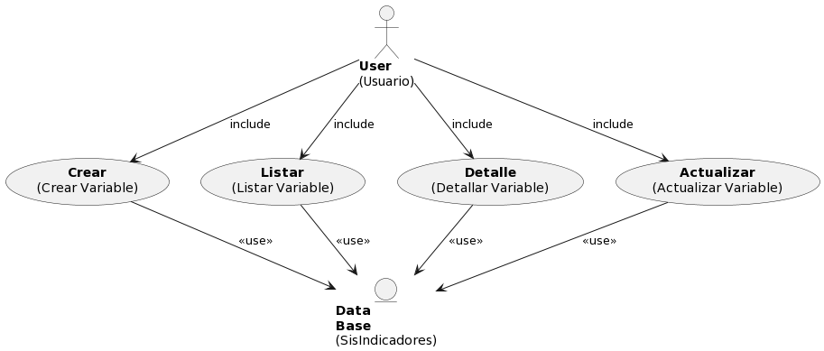
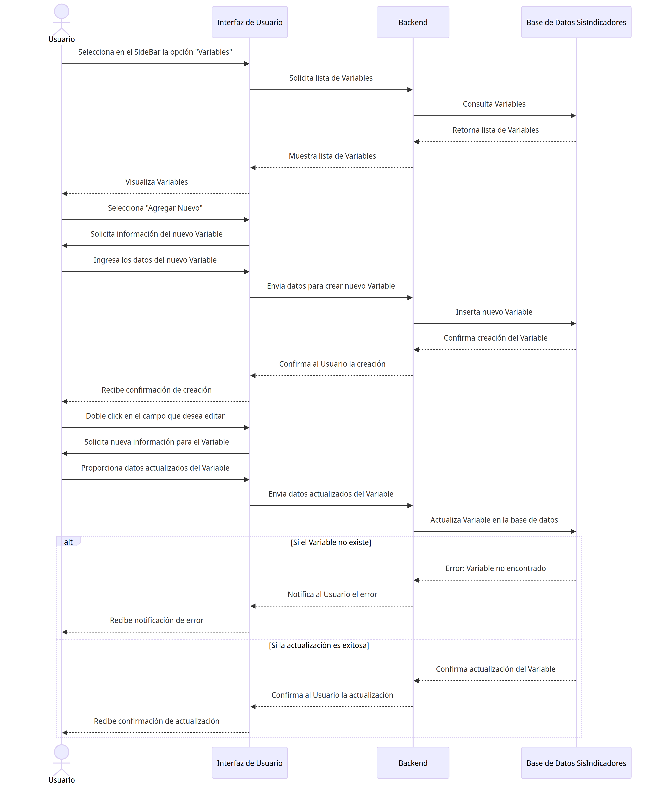

# Variable

## Diagramas

### Diagrama de Caso de Uso

### Diagrama de Secuencia

## Historias de Usuario

### Listar

| **Caso de Uso** | Listar Variables |
|---|---|
| **Variables** | Usuario, Base de datos SisIndicadores |
| **Tipo** | Inclusión |
| **Propósito** | Listar todos las Variables disponibles en el sistema de indicadores para su administración y consulta. |
| **Resumen** | Este caso de uso se activa cuando el Usuario requiere ver la lista completa de Variables. Permite al usuario visualizar una lista ordenada y posiblemente filtrada de Variables registrados en el sistema. |
| **Precondiciones** | El Usuario debe estar autenticado y tener permisos para acceder a la lista de Variables. |
| **Flujo Principal** | El Usuario accede a la sección "Variables" en la interfaz de usuario (UI-1). Se le presenta una lista de Variables disponibles en el sistema. El usuario puede seleccionar una Variable para ver más detalles o realizar acciones adicionales. |
| **Subflujos** | Desde la lista de Variables, el usuario puede optar por ver detalles de una Variable específico (Detalle), actualizar información de una Variable (Actualizar), o crear un nuevo Variable (Crear). Puede volver a esta lista en cualquier momento para realizar más operaciones. |
| **Excepciones** | Si la lista no puede ser generada o está vacía, se muestra el mensaje "The variable list could not be retrieved. Try again later." Si el Usuario no tiene permisos, se muestra "The operation was cancelled." |
---

### Detalle

| **Caso de Uso** | Detalle de Variable |
|---|---|
| **Variables** | Usuario, Base de datos SisIndicadores |
| **Tipo** | Inclusión |
| **Propósito** | Proporcionar al Usuario una visualización detallada de la información de una Variable específico dentro del sistema de indicadores. |
| **Resumen** | Este caso de uso comienza cuando el Usuario selecciona una Variable específico de la lista para ver en detalle. El sistema muestra una página con toda la información detallada del Variable seleccionado. |
| **Precondiciones** | El Usuario debe estar autenticado y tener permisos para acceder a los detalles de una Variable. |
| **Flujo Principal** | En la interfaz de gestión de Variables (UI-1), el Usuario selecciona una Variable de la lista.  |
| **Subflujos** | Ninguno|
| **Excepciones** | Si la Variable no existe o no se encuentra, se muestra el mensaje "The variable was not found." Si ocurre un error al intentar mostrar los detalles, se muestra "An error occurred while processing the request. Try to contact the support team." |
---

### Crear

| **Caso de Uso** | Crear Variable |
|---|---|
| **Variables** | Usuario, Base de datos SisIndicadores |
| **Tipo** | Inclusión |
| **Propósito** | Permitir al Usuario agregar un nuevo Variable al sistema de indicadores. |
| **Resumen** | Este caso de uso se inicia cuando el Usuario necesita ingresar un nuevo Variable al sistema. El Usuario proporciona los detalles necesarios para registrar un nuevo Variable y lo añade al sistema a través de una interfaz de usuario. |
| **Precondiciones** | El Usuario debe estar autenticado y tener permisos para añadir nuevos Variables al sistema. |
| **Flujo Principal** | El Usuario navega a la opción "Agregar Nuevo" en la interfaz de usuario (UI-1). Completa el formulario con la información del nuevo Variable y selecciona la opción "Guardar" para crear el registro. |
| **Subflujos** | Después de la creación, el Usuario puede ser redirigido a la lista de Variables para confirmar que el nuevo Variable se ha agregado correctamente o para continuar con la creación de otros Variables. |
| **Excepciones** | Si los detalles proporcionados son insuficientes o incorrectos, se muestra el mensaje "cannot be empty." Si la Variable ya existe, se muestra "The variable already exists." En caso de un error inesperado durante la creación, se muestra "Something was wrong. Try again later." |
---

### Actualizar

| **Caso de Uso** | Actualizar Variable |
|---|---|
| **Variables** | Usuario, Base de datos SisIndicadores |
| **Tipo** | Inclusión |
| **Propósito** | Habilitar al Usuario para modificar la información de una Variable existente dentro del sistema de indicadores. |
| **Resumen** | Este caso de uso ocurre cuando un Usuario necesita cambiar los datos de una Variable. El Usuario selecciona una Variable específico de la lista y actualiza la información necesaria a través de un formulario. |
| **Precondiciones** | El Usuario debe estar autenticado y tener los permisos necesarios para editar la información de una Variable. |
| **Flujo Principal** | Desde la página de gestión de Variable (P-1), el Usuario selecciona una Variable de la lista. Doble click en el campo que desea modificar y reemplaza el valor. Presiona el icono de "guardar". El sistema valida y actualiza el valor. |
| **Subflujos** | Una vez actualizado la Variable, el Usuario puede volver a la lista de Variables para ver los cambios realizados o para actualizar otros Variables. |
| **Excepciones** | Si la Variable no se encuentra para la actualización, se muestra "The variable was not found." Si hay discrepancias en los datos proporcionados, se muestra "The value does not coincide with." Si se produce un fallo al guardar los cambios, se muestra "Something was wrong. Try again later." |
---
